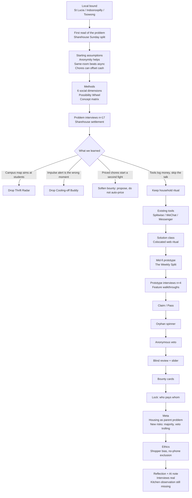

# Process Flow

This is the project flow the brief asked for: short notes at each stage, in the order we actually moved.

## Stage notes

| Stage | What we did | What we carried forward |
| --- | --- | --- |
| Bound | Picked inner-west Brisbane sharehouses, not a campus population | Geography stays; user is housemate |
| Assumptions | Named the speech-act problem | Still the core bet |
| Methods | Frameworks, three concepts, 17 problem interviews, four prototype interviews, a working prototype | Interviews ranked the bets and exposed design risks |
| Filter | Killed location and impulse-buy branches; softened priced chores | Kitchen ritual remains |
| Current practice | Splitwise, WeChat, Messenger, equal split by default | Expectation: item totals, not lectures |
| Solution class | Compared posters, tokens, async apps, colocated UI | Web ritual, no install |
| Prototype | Draft, orphan, veto, review, bounty, lock | Playable mid-fi + screen flows |
| Meta / ethics | Parent problems and who we might harm | Testing must watch pile-ons |
| Reflection | Five-person team; recall interviews, no live kitchen yet | Next: one real Sunday |

## Prototype path (user-facing)

Welcome → pick a seat → swipe the receipt → maybe a spinner → confirm fair or veto → review heavy items → optional bounty → locked transfers.
